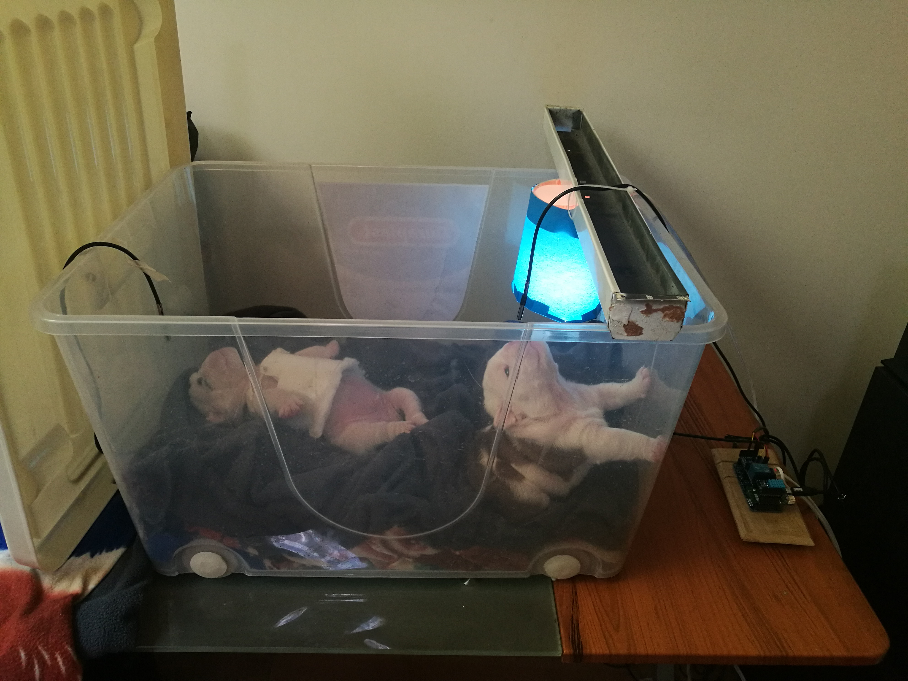
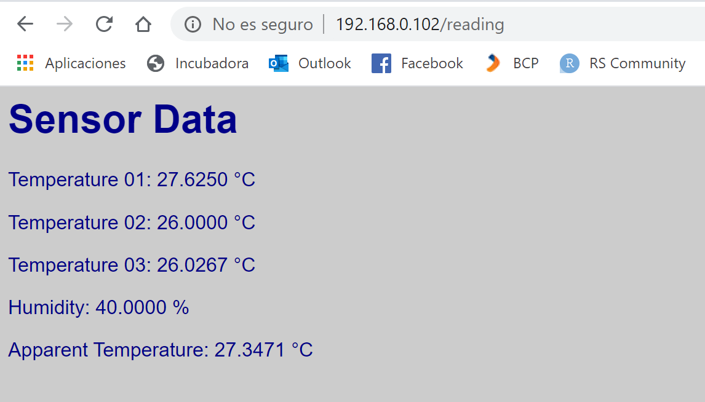
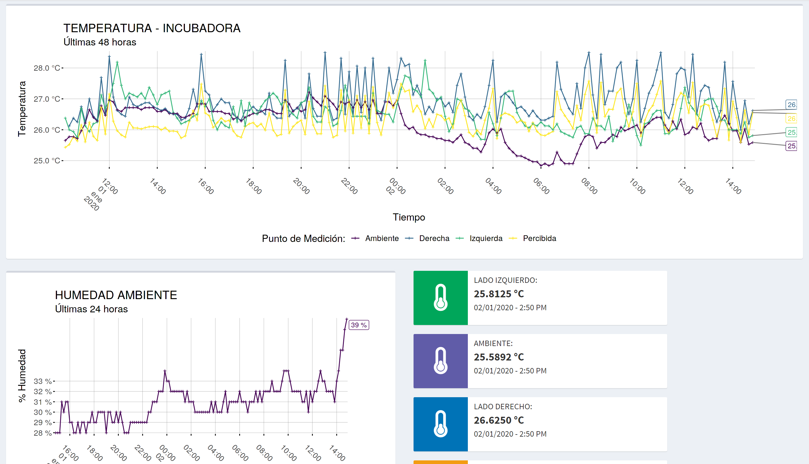

# Puppy Incubator

## Introduction

If you have a new litter and you are in need of a puppy incubator but you don't want to spend thousands of dollars on a commercial one, this project is for you.

This incubator project currently has the following features:

* Automatic temperature control, using DS18B20 temperature sensors and a heat source (IR lamp, or even a regular incandescent bulb) activated through a relay accordingly to rules set by you. 

* You can monitor the current temperature and humidity accessing the IP of the D1 mini Pro board (it has a webserver).

  

* You can log the data to a database with an ETL process since it also provides JSON output trough an HTTP connection.

  

* If for some reason the temperature goes out of control (based on preset limits) it sends `Push` notifications to your cellphone using the `IFTTT` service and `Webhooks`.

* It broadcasts the temperature status over `MQTT` messages.

* The additional Wemos D1 mini board with a NeoPixel shield, receives the `MQTT` message and displays informative colors accordingly to the current temperature status (Hot, Normal, Cold).

* It supports OTA updates on the same LAN.

## Materials

* X1 - Big enough plastic container
* X1 - Light socket
* X1 - Heat lamp
* X1 - Lolin D1 mini Pro board
* X1 - Wemos D1 mini
* X1 - Wemos NeoPixel shield
* X1 - Tripler Base from Wemos
* X2 - DS18B20 probe temperature sensors
* X1 - DS18B20 shield from Wemos
* X1 - DHT11 shield from Wemos
* X1 - Relay shield from Wemos

## Further development

Next steps to improve this project would be:
* Adding a FAN to lower temperature or decrease the humidity inside the incubator.
* Adding a humidifier to control humidity levels inside the incubator.
* Adding an IP camera with a separate ESP32 modulo to remotely check on the puppies.
